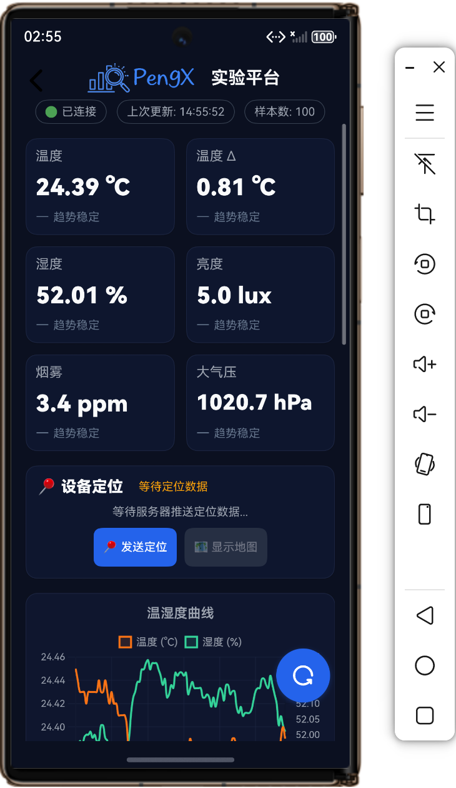

  

  
  
  

<h1 align="center">PengX智能环境监测系统 NEXT</h1>

本仓库为「电子信息工程专业」毕业设计《基于 STM32 和物联网的智能环境监测系统》的HarmonyOS ArkTS代码，面向实验室、机房、宿舍等小场景的
**多设备多传感器环境监测云平台**。

本项目尽力还原<a href="https://znhj.iepose.cn">Pengx智能环境监测系统</a>的H5版本，为HarmonyOS带来**原生体验**。

> 部分功能页面体验远超HTML5原版，欢迎自行构建体验。➡
> 更多介绍请访问<a href="https://github.com/longmxuc/Intelligent-Monitoring-System">原项目README</a>

**Beta4效果图**

- **亮色模式**
   
  
  
  
  
  
  
  
  
  
  
- **暗色模式**
   
  
  
  
  
  
  
  